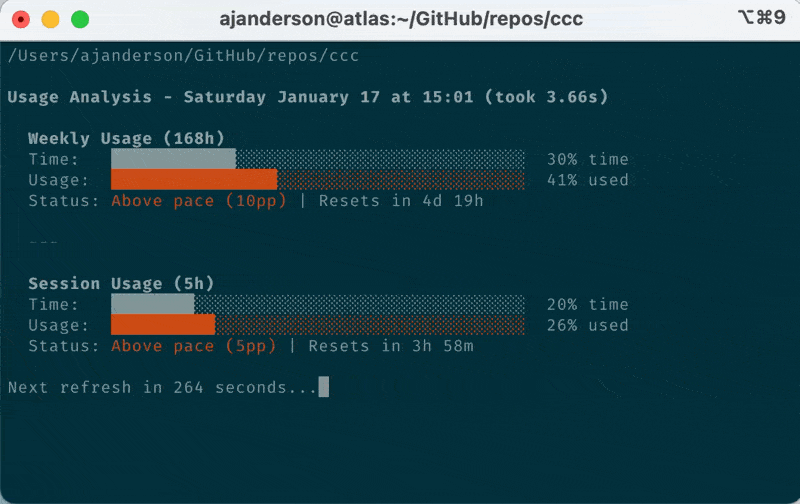

<div align="center">

# 🚀 Claude Code Cost (Usage Analyzer)

**A visual, pace-aware CLI tool for monitoring your Claude Code usage limits**

[](https://opensource.org/licenses/MIT) 

[](https://www.zsh.org/)

)]()]()()

[]()

</div>

---

## 📖 Overview x

**ccc** (Claude Code Usage Analyzer) transforms Claude Code's basic `/usage` output into actionable insights. Instead of just seeing percentages, you get:

- ⏱️ **Time context** - How much of your window has elapsed?
- 📊 **Pace analysis** - Are you consuming faster or slower than time is passing?
- ⏰ **Reset countdown** - Exactly when does your limit reset?
- 🎨 **Visual indicators** - Color-coded bars showing usage vs. time

### 🎬 Demo

- 

## 📚 Background: Claude Code Usage Limits

Claude Code uses a **dual-window rate limiting system**:

### Session Window (5 hours)

A rolling 5-hour window that starts when you begin using Claude Code. This governs short-term burst usage.

### Weekly Window (7 days / 168 hours)

A separate 168-hour window that tracks longer-term consumption. Introduced in August 2025, this prevents sustained heavy usage from exhausting resources.

### Why Pacing Matters

If you're at **50% usage** but only **25% through your time window**, you're consuming at **2x sustainable pace** and will likely hit your limit before reset. This tool makes that immediately visible.

> 📖 For more details on Claude Code limits, see the [official documentation](https://support.claude.com/en/articles/11145838-using-claude-code-with-your-pro-or-max-plan).

---

## 🚀 Installation

### Prerequisites

| Dependency           | Purpose                                                               | Installation                                                     |
| -------------------- | --------------------------------------------------------------------- | ---------------------------------------------------------------- |
| **zsh**              | Shell interpreter (script uses zsh-specific features)                 | Pre-installed on macOS; `apt install zsh` on Linux               |
| **expect**           | Automates interaction with Claude Code's interactive `/usage` command | `brew install expect` (macOS) or `apt install expect` (Linux)    |
| **python3**          | Parses output and calculates pacing metrics                           | Pre-installed on most systems                                    |
| **claude** or **cc** | The Claude Code CLI itself                                            | See [Claude Code installation](https://docs.claude.com/en/code/) |

### Quick Start

1. **Clone the repository:**

   ```bash
   git clone https://github.com/ajanderson1/ccc.git
   cd ccc
   ```
1. **Make the script executable:**

   ```bash
   chmod +x cc_usage.sh
   ```
1. **(Optional) Add to your PATH or create an alias:**

   ```bash
   # Add to ~/.zshrc or ~/.bashrc
   alias ccc="/path/to/ccc/cc_usage.sh"
   ```

---

## 💻 Usage

### Basic Usage

Simply run the script:

```bash
./cc_usage.sh
```

Or if you set up the alias:

```bash
ccc
```

### Loop Mode

Run continuously with automatic refresh:

```bash
# Refresh every 5 minutes (default)
ccc --loop

# Refresh every 60 seconds
ccc --loop --interval 60
```

The loop mode clears the screen, displays updated usage, then shows a countdown timer until the next refresh. Press `Ctrl+C` to exit.

### What Happens

The script will:

1. 🚀 Launch Claude Code with the `/usage` command
2. 📸 Capture the output using `expect` and `script`
3. 🔍 Parse and analyze the usage data
4. 📊 Display a visual pace-aware breakdown

### Command Line Options

| Option       | Description                                           |
| ------------ | ----------------------------------------------------- |
| `--loop`     | Run continuously with countdown between refreshes     |
| `--interval` | Seconds between refreshes in loop mode (default: 300) |
| `-h, --help` | Show usage information                                |

### Environment Variables

| Variable        | Default | Description                                              |
| --------------- | ------- | -------------------------------------------------------- |
| `DEBUG`         | `0`     | Set to `1` to enable debug output and preserve log files |
| `MAX_RETRIES`   | `3`     | Number of retry attempts if output capture fails         |
| `LOOP_INTERVAL` | `300`   | Default seconds between refreshes in loop mode           |

**Example with debug mode:**

```bash
DEBUG=1 ./cc_usage.sh
```

---

## 🔧 How It Works

This tool is admittedly a **"hack"** - it works around the lack of a programmatic API for usage data:

### The Problem

Claude Code's `/usage` command is interactive and designed for human consumption. There's no API endpoint or machine-readable output available for Pro/Max subscribers (unlike API-based accounts which have proper rate limit headers).

### The Solution

1. **`expect`** - A Unix tool for automating interactive applications. The script spawns Claude Code, waits for the usage display to render, then sends an escape key to exit.
1. **`script`** - Captures all terminal output (including ANSI escape codes) to a log file. This is necessary because expect alone doesn't reliably capture the full output.
1. **Python parser** - Strips ANSI codes, extracts percentages and reset times using regex, calculates elapsed time percentages, and renders the visual comparison.

### Key Technical Details

- ⚡ Uses `zmodload zsh/datetime` for high-precision timing
- 📁 Creates temporary files for the expect driver and captured output
- 🧹 Cleans up temporary files on exit (including interrupt signals)
- 🌍 Handles various date/time formats from Claude's output
- 🔄 Includes "tomorrow logic" for time-only reset values that appear to be in the past

---

## ⚠️ Limitations

- **macOS/Linux only** - Relies on Unix tools (`script`, `expect`)
- **zsh required** - Uses zsh-specific features (`zmodload zsh/datetime`, `$EPOCHREALTIME`)
- **Timing sensitive** - The expect script has hardcoded timeouts; slow connections may fail
- **Fragile parsing** - If Anthropic changes the `/usage` output format, the regex patterns may break
- **No caching** - Each run spawns a new temporary Claude Code instance (~1 second overhead)

---

## 🐛 Troubleshooting

### "Error: 'expect' is not installed"

**Solution:** Install expect:

```bash
# macOS
brew install expect

# Linux
apt install expect
```

### "Error: 'claude' or 'cc' binary not found"

**Solution:** Ensure Claude Code is installed and in your PATH. See [installation docs](https://docs.claude.com/en/code/).

### "Error: No output captured after X attempts"

**Try these steps:**

- ✅ Check that Claude Code is working: run `claude /usage` manually
- ✅ Ensure you're authenticated with Claude Code
- ✅ Try increasing retries: `MAX_RETRIES=5 ./cc_usage.sh`
- ✅ Enable debug mode to see what's happening: `DEBUG=1 ./cc_usage.sh`

### "Error: Data incomplete" or "Date error"

The error now shows diagnostic information including which data is missing and a preview of what was captured. This could happen if:

- **Timing issue** - The output didn't render completely. The script retries automatically up to `MAX_RETRIES` times.
- Your locale uses different date formatting
- Anthropic has updated the `/usage` output format
- The timezone display format has changed

**Solution:** Use debug mode to investigate:

```bash
DEBUG=1 ./cc_usage.sh
```

This will show retry attempts and preserve the log file for inspection.

---

## 📄 License

MIT License - see [LICENSE](LICENSE) for details.

---

</div>
